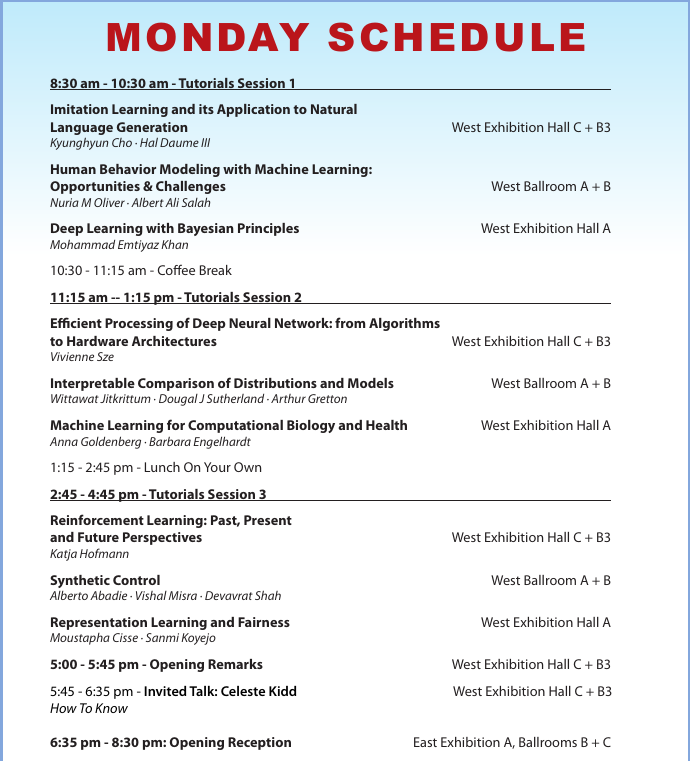

# Dec 9, Monday 

## [Tutorials](https://nips.cc/Conferences/2019/ScheduleMultitrack)

8:30 am : West Hall A\
[Deep Learning with Bayesian Principles](https://nips.cc/Conferences/2019/ScheduleMultitrack?event=13205)\
Emtiyaz Khan (RIKEN)

11:15 am : West Hall A\
[Interpretable Comparison of Distributions and Models](https://nips.cc/Conferences/2019/ScheduleMultitrack?event=13208)\
Wittawat Jitkrittum, Dougal J Sutherland, Arthur Gretton

02:45 pm: West Hall C + B3\
[Reinforcement Learning: Past, Present, and Future Perspectives](https://nips.cc/Conferences/2019/ScheduleMultitrack?event=13211)\
Katja Hofmann

05:00 pm : West Hall C + B3\
Opening Remarks

5:45 - 6:35 AM\
**Invited talk: Celeste Kidd**\
How To Know

06:35 pm: East Exhibition A, Ballrooms B C\
Opening Reception
