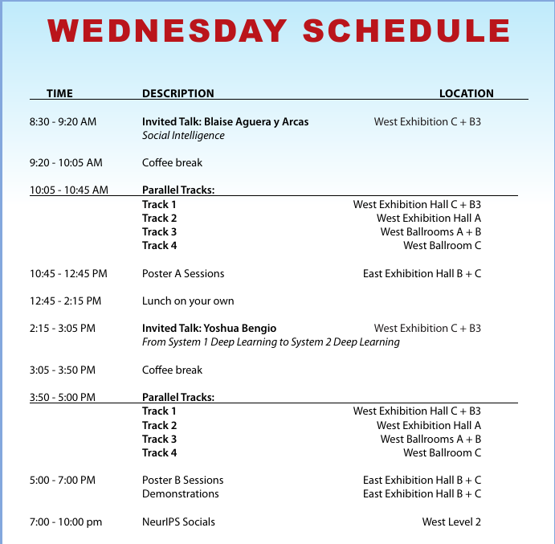

# Dec 11, Wednesday 

## [Orals](https://nips.cc/Conferences/2019/ScheduleMultitrack?text=&session=&event_type=&day=2019-12-11)

10:05 am : West Exhibition Hall C + B3

[Scene Representation Networks: Continuous 3D-Structure-Aware Neural Scene Representations](https://nips.cc/Conferences/2019/ScheduleMultitrack?event=15864)\
Vincent Sitzmann (Stanford University)\
Michael Zollhoefer (Facebook Reality Labs)\
Gordon Wetzstein (Stanford University)

## [Spotlights](https://nips.cc/Conferences/2019/ScheduleMultitrack?text=&session=&event_type=&day=2019-12-11)

10:20 am : West Exhibition Hall C + B3	

[A Condition Number for Joint Optimization of Cycle-Consistent Networks](https://nips.cc/Conferences/2019/ScheduleMultitrack?event=15865)\
**Leonidas J Guibas**\
Qixing Huang (The University of Texas at Austin)\
Zhenxiao Liang (The University of Texas at Austin)

[Cascade RPN: Delving into High-Quality Region Proposal Network with Adaptive Convolution](https://nips.cc/Conferences/2019/ScheduleMultitrack?event=15866)\
Thang Vu (KAIST)\
Hyunjun Jang (KAIST)\
Trung X. Pham (KAIST)\
Chang Yoo (KAIST)

[Probabilistic Watershed: Sampling all spanning forests for seeded segmentation and semi-supervised learning](https://nips.cc/Conferences/2019/ScheduleMultitrack?event=15867)\
Enrique Fita Sanmartin (Heidelberg University)\
Sebastian Damrich (Heidelberg University)\
Fred Hamprecht (Heidelberg University)

[DM2C: Deep Mixed-Modal Clustering](https://nips.cc/Conferences/2019/ScheduleMultitrack?event=15868)\
Yangbangyan Jiang (Chinese Academy of Sciences)\
Qianqian Xu (Chinese Academy of Sciences)\
Zhiyong Yang (University of Chinese Academy of Sciences)\
Xiaochun Cao (Chinese Academy of Sciences)\
Qingming Huang (University of Chinese Academy of Sciences)

[Learning Object Bounding Boxes for 3D Instance Segmentation on Point Clouds](https://nips.cc/Conferences/2019/ScheduleMultitrack?event=15869)\
Bo Yang (University of Oxford)\
Jianan Wang (DeepMind)\
Ronnie Clark (Imperial College London)\
Qingyong Hu (University of Oxford)\
Sen Wang (Heriot-Watt University)\
Andrew Markham (University of Oxford)\
Niki Trigoni (University of Oxford)

## [Orals](https://nips.cc/Conferences/2019/ScheduleMultitrack?text=&session=&event_type=&day=2019-12-11)

03:50 PM : West Ballrooms A + B

[Guided Similarity Separation for Image Retrieval](https://nips.cc/Conferences/2019/ScheduleMultitrack?event=15703)\
Chundi Liu (Layer6 AI)\
Guangwei Yu (Layer6)\
Maksims Volkovs (Layer6 AI)\
Cheng Chang (Layer6 AI)\
Himanshu Rai (Layer6 AI)\
Junwei Ma (Layer6 AI)\
Satya Krishna Gorti (Layer6 AI)

## [Spotlights](https://nips.cc/Conferences/2019/ScheduleMultitrack?text=&session=&event_type=&day=2019-12-11)

4:05 pm : West Ballrooms A + B

[Fast and Flexible Multi-Task Classification using Conditional Neural Adaptive Processes](https://nips.cc/Conferences/2019/ScheduleMultitrack?event=15704)\
James Requeima (University of Cambridge / Invenia Labs)\
Jonathan Gordon (University of Cambridge)\
John Bronskill (University of Cambridge)\
Sebastian Nowozin (Google Research Berlin)\
Richard Turner (Cambridge)

[Multimodal Model-Agnostic Meta-Learning via Task-Aware Modulation](https://nips.cc/Conferences/2019/ScheduleMultitrack?event=15705)\
Risto Vuorio (University of Michigan)\
Shao-Hua Sun (University of Southern California)\
Hexiang Hu (University of Southern California)\
Joseph Lim (University of Southern California)

[Efficient Meta Learning via Minibatch Proximal Update](https://nips.cc/Conferences/2019/ScheduleMultitrack?event=15706)\
Pan Zhou (National University of Singapore)\
Xiaotong Yuan (Nanjing University of Information Science & Technology)\
Huan Xu (Alibaba Group)\
Shuicheng Yan (National University of Singapore)\
Jiashi Feng (National University of Singapore)

[Reconciling meta-learning and continual learning with online mixtures of tasks](https://nips.cc/Conferences/2019/ScheduleMultitrack?event=15707)\
Ghassen Jerfel (Duke University)\
Erin Grant (UC Berkeley)\
Tom Griffiths (Princeton University)\
Katherine Heller (Google)

## [Orals](https://nips.cc/Conferences/2019/ScheduleMultitrack?text=&session=&event_type=&day=2019-12-10)

4:25 pm : West Ballrooms A + B

[Geometry-Aware Neural Rendering](https://nips.cc/Conferences/2019/ScheduleMultitrack?event=15708)\
Joshua Tobin (OpenAI)\
Wojciech Zaremba (OpenAI)\
Pieter Abbeel (UC Berkeley & covariant.ai)

## [Spotlights](https://nips.cc/Conferences/2019/ScheduleMultitrack?text=&session=&event_type=&day=2019-12-10)

4:40 pm : West Exhibition Hall C + B3

[Cold Case: The Lost MNIST Digits](https://nips.cc/Conferences/2019/ScheduleMultitrack?event=15877)\
Chhavi Yadav (NYU)\
**Leon Bottou (Facebook AI Research)**

[An adaptive nearest neighbor rule for classification](https://nips.cc/Conferences/2019/ScheduleMultitrack?event=15878)\
Akshay Balsubramani (Stanford)\
Sanjoy Dasgupta (UC San Diego)\
Yoav Freund (UCSD)\
Shay Moran (Google AI Princeton)

[Multilabel reductions: what is my loss optimising?](https://nips.cc/Conferences/2019/ScheduleMultitrack?event=15879)\
Aditya Menon (Google)\
Ankit Singh Rawat (Google Research)\
Sashank Reddi (Google)\
Sanjiv Kumar (Google Research)

[Optimal Sparse Decision Trees](https://nips.cc/Conferences/2019/ScheduleMultitrack?event=15880)\
Xiyang Hu (Carnegie Mellon University)\
Cynthia Rudin (Duke)\
Margo Seltzer (University of British Columbia)

# Demonstrations

5:30 pm -- 10:30 PM @ East Exhibition Hall B + C\

808: AllenNLP Interpret: Explaining Predictions of NLP Models\
Jens Tuyls · Eric Wallace · Matt Gardner · Junlin Wang · Sameer Singh · Sanjay Subramanian

810: AIDEme: An active learning based system for interactive exploration of large datasets\
Enhui Huang · Luciano Di Palma · Laurent Cetinsoy · Yanlei Diao · Anna Liu

**813: Real Time CFD simulations with 3D Mesh Convolutional Networks**\
Pierre Baque · Pascal Fua · François Fleuret

# Socials

[ML 4 Space Social](https://www.eventbrite.com/e/ml-4-space-neurips-tickets-83996145733)\
Wed Dec 11th 07:00 -- 10:00 PM @ West 217 - 219

[T-PRIME](https://www.eventbrite.com/e/t-prime-neurips-social-tickets-83317748629)\
Wed Dec 11th 07:00 -- 10:00 PM @ West 223 + 224

