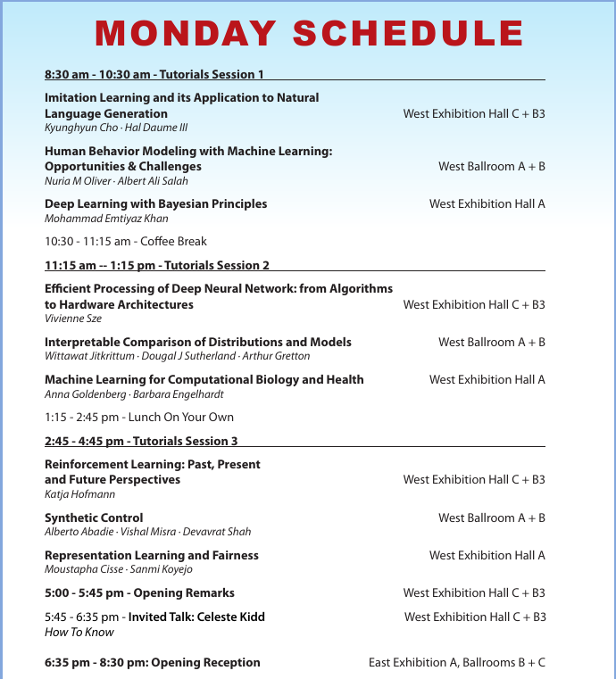
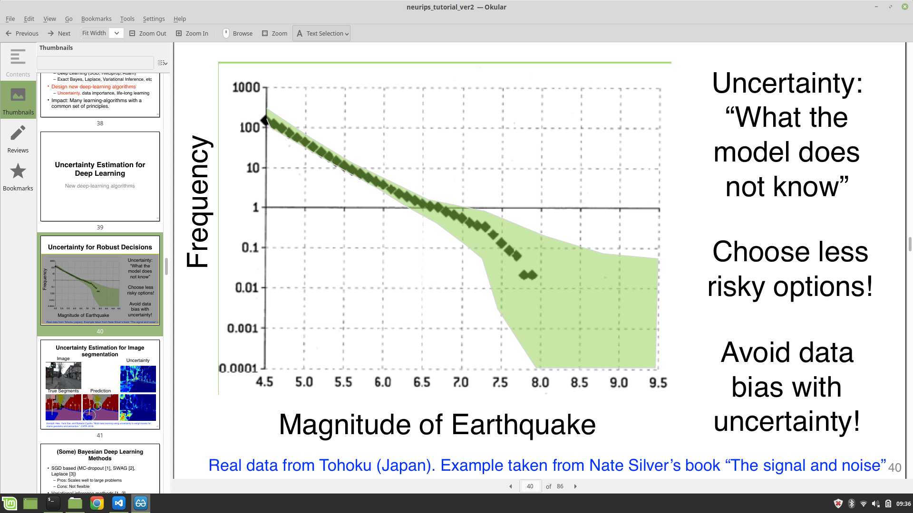
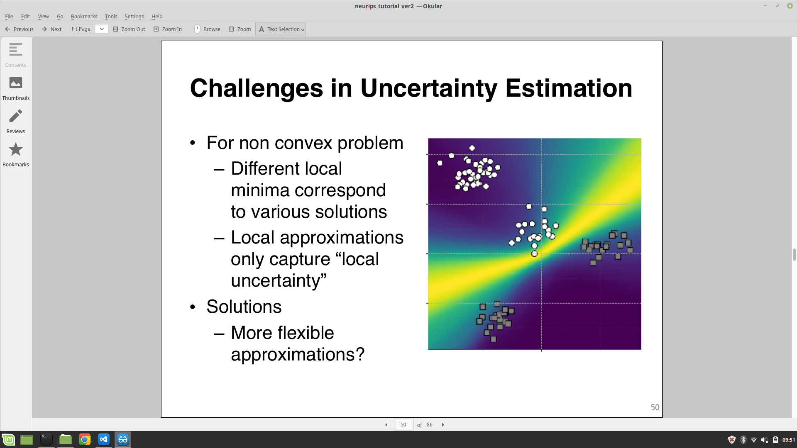
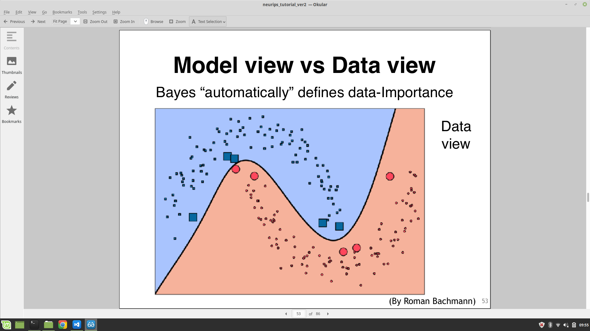

# Dec 9, Monday 

## [Tutorials](https://nips.cc/Conferences/2019/ScheduleMultitrack)

# [Deep Learning with Bayesian Principles](https://nips.cc/Conferences/2019/ScheduleMultitrack?event=13205)
Emtiyaz Khan (RIKEN), RIKEN Center for AI project

**Goal:**\
Human (Bayesian) learning: Life-long learning with small chunks of data.\
Deep Learning: Bulk learning from large amount of data.\
Parsi, German "Continual lifelong learning with neural networks: A review"

**Complementary**:

    * Bayesian learning: can estimate uncertainty, incremental learning\
    * Deep learning: can hadle large data, scalable

**Deep learning vs Bayesian learning**:

    * Deep learning: 
        * Frequentist (Empirical risk minimization or MLE)
        * Scalable to large data and complex model
        * Example of Nate Silver's book (Tohoku data) (**Good example**)
        * Little data on accidents for self-driving cars (data-bias)
        * Differentiation (local)
    * Bayesian principles: https
        * Sample: Prior
        * Score: Liklihood
        * Normalize: Prior*Liklihood
        * A global method: Doesn't scale, enable sequential update
        * Integrations (global)

**Deep learning**:

    * Gradient descent: derived by choosing Gaussian with fixed covariance
    * Newtons methos: derived by choosing Gausian with non-fixed covariance
    * Khan and Rue, "Learning-ALgorithms from Bayesian Principles" (**Good reference**)
    * "Global" to "local": $$ Eq[l(\theta)] \approx l(m) $$
    * RMSProp: 
        * Choose gaussian with diagonal covarince
        * Replace Hessian by square of gradients
        * Add square root for scaling vector
    * For Adam, use  Heavy-ball term with KL divergence as momentum.

### Summary:
    * Gradient descent is derived using a Gaussian with fixed covariance, and estimating the mean
    * Newton’s method is derived using multivariate Gaussian
    * RMSprop is derived using diagonal covariance
    * Adam is derived by adding heavy-ball momentum term
    * For “ensemble of Newton”, use Mixture of Gaussians [1]
    * To derive DL algorithms, we need to switch from a “global” to “local” approximation 
    * Then, to improve DL algorithms, we just need to add some “global” touch to the DL algorithms

## Uncertainty estimation for deep learning

Ovadia, Yaniv, et al. "Can You Trust Your Model's Uncertainty? Evaluating Predictive Uncertainty Under
Dataset Shift." NeurIPS (2019).

Yarin Gal’s tutorial (http://bdl101.ml/)

### Model view vs Data view: Bayes “automatically” defines data-Importance

“Global” to “Local”:

    * Posterior approximations connect “global” parameters (e.g. DNN  eights) to “local” parameters (e.g. data examples)
    * The local parameters can be seen as “dual” variables that define the “importance” of the data

**Continual learning:** Kirkpatrick, James, et al. "Overcoming catastrophic  forgetting in neural networks." Proceedings of the national academy of sciences 114.13 (2017): 3521-3526.

Active deep learning: Select "important" examples while training (By Roman Bachmann).

# [Interpretable Comparison of Distributions and Models](https://nips.cc/Conferences/2019/ScheduleMultitrack?event=13208)
Wittawat Jitkrittum, Dougal J Sutherland, Arthur Gretton

Gatsby Unit UCL

Class of problems:

    * Samples from unknown distributions P and Q. Do P & Q differ?
    * Samples from unknown Q, model P & Q. Do P & Q differ?

## Divergence measures:
  * Integral probability metrics (IPM)
  * $\phi$-divergences

P-Q difference: Integral prob. metrics 

    * Wasserstein
    * MMD
    * Find a "well behaved function" $f(x)$ to maximize
$$ E_Pf(X) - E_Qf(Y) $$

IPMs in practice:
    * Wasserstrin-1 distance: Drops when two distributions move closer to each other.
    * MMD: Maximum mean discrepancy

$\phi$-divergences: P/Q ratio: $\phi$-divergences

KALE Divergence

Wasserstein Autoencoder

### Testing Explicit Models with Kernel Stein

Can we compute MMD with **samples** and a **density p**?\
Problem1: ususally can't compute $E_pf$ in closed form\
Problem2: cannot sample from p.

# Efficient Processing of DNN: From algorithms to hardware

## CPU vs GPU:
    * Both have very optimized matrix multiplication libraries
    * Map DNN to Matrix Mulitplication
    * Convolutional layer can be converted to Toeplitz Matrix (Data is repeated)
    * CPU: OpenBLAS, InTEL MKL, 
    * GPU: CuBlas
    * Matric multiplication tiled to fit in cache (i.e. on-chip memory) and computation ordered to reuse cache
    * Reduce operations in matrix multiplication: FFT, Strassen, Winograd
    * Perform more MACs per instruction:
      * CPU: SIMD/Vector instructions
      * GPU: SIMT/Tensor Instructions
    * Perform more MACs per cycle without increasing memory bacdwidth by adding reduced precision
    * Software:
      * Reduce unnecessary MACs
      * Increase PE utilization
    * Hardware:
      * Reduce time per MAC
      * Increase number of parallel MACs
      * Increase PE utilization (Increase on-ship storage, external bandwidth increase NVLink etc)

## Specialized domain:
    * Operations exihibit high parallelism
    * Memory Access is the Bottelneck
    * Input data reuse: exploit low cost memory: Convolutional reuse, Fmap reuse, Filter reuse
    * Spatial architecture
    * Goal: increase reuse of input data (weights and activations) and local partial sums accumulation (data flow)

## Efficient dataflows:
    * Data Mmovement is expensive
    * Specialized hardware with small low cost memory near compute
    * Maximize data reuse at low cost levels of memory hierarchy
    * Weight stationarity
    * Output stationarity
    * Input stationarity
    * Row stationary dataflow

# [Reinforcement Learning: Past, Present, and Future Perspectives](https://nips.cc/Conferences/2019/ScheduleMultitrack?event=13211)
Katja Hofmann

Reinforcement learning is all about making decisions and learning from those.

Reinforcement learning = Decision making and Learning under uncertainty

## Formalizing RL
### Markov decision process (MDPs) [Bellman 1953]

**agent** with a (learnable) behaviour policy\
**environment** with initially unknown dynamics and reward.

Dynamics: 
$$ T(s_{t+1} | s_t, a_t) $$
Reward: 
$$ R(r_{t+1} | s_t, a_t) $$
Behaviour policy:
$$ \pi(a | s)$$

### Optimality in MDP

Finite-horizon:
$$ E (\sum_{t=0}^{h} r_t)$$

Infinite-horizon:
$$ E (\sum_{t=0}^{\infty} \gamma^tr_t)$$

Average-reward

### Learning Performance

Asymptotic convergence: 
$$ \pi_n -> \pi^* \text{ as } n->\infty$$

PAC

Regret: Highest possible achievable at current time - how much the agent achieved

### Key RL Challenges

    * Explore-exploit
    * Credit assignment
    * Function approximation

[Kaelbling, Littman & Moore, 1996]

## Value Functions

### Dynamic programming and Bellman equations

Optimal state-value function

Temporal Difference Error

TD-Gammon: Gerald Tesauro, TJ Watson Research Center

Q-Learning: Q is the value of the state-action pair [Watkins 1989]

Project Malmo: Try Tutorial 6

### Q-Learning with Function Approximation
Parametrize Q with function Approximation, e.g. a deep neural network

### Stability
THe "deadly triad". In face of all three, learning is unstable.

    1. Off-policy learning
    2. Flexible function approximation
    3. Bootstrapping

Solution: DQN stabilizes learning.

## Exploration

    * Optimistic initialization: Mountain car problem
    * Epsilon-greedy approach
    * Softmax policy
    * Upper confidence bound
    * Posterior sampling
  
## Policy gradient and actor critic approaches

* REINFORCE Framework
  * Proceeds in episodes
  * Policy is parametrized by parameter $\theta$
  * NeurIPS 2016 Tutorial

### Actor critic with deep function approximation

Need to balance between learning speed, stability

## RL Applications

Personalizer
http://hunch.net/~rwil

Robotics
https://sites.google.com/view/icml17deeprl

Tutoring systems
https://cs.stanford.edu/people/ebrun/NIPS_2017_tutorial_brunskill.pdf

**Key Challenge: Sample efficient algorithms**

## Generalization

Example: generalization using successor features, rapidly adapt to new reward structure.\
How may tasks are needed before modern approaches generalize?\
Regularization: Prevous appraoches developed for supervised learning, not RL.

## Structure

**Meta learning:** learn to learn, eg. learn an update rule from related tasks. Example, tasks are related through low-dimensional embedding.

**Model-agnostic meta learning:** Flexible meta-learning approach based on 2nd order gradient. 2-stage gradient-based approach on batches on tasks.

**CAVIA:** Many parameter + few data points can lead to overfitting.

## Models

Models are good way of introducing structure.
AlphaGo: Model is fully known.

Model-based RL: What if we don't know the model - learn from data? [Deisenroth & Rasmussen, Ha & Schmidhuber, Chua et al.]

Terenin, Hofmann & Deisenroth [Steindor's]

## New Challenges

Multi-agent RL in Malmo (MARLO)

# Invited talk: How To Know by Celeste Kidd

KIDD Lab

5 things everyone in ML should know about humans
 1. Humas continuously form beliefs (Book: Beyond Zero and One)
 2. Certainty diminishes interest
 3. Certainty is driven by feedback
 4. Less feedback may encourage overconfidence
 5. Humans form beliefs quickly

There is no such thing as a neutral platform.

Our brains are no match for our technology. Nytimes

